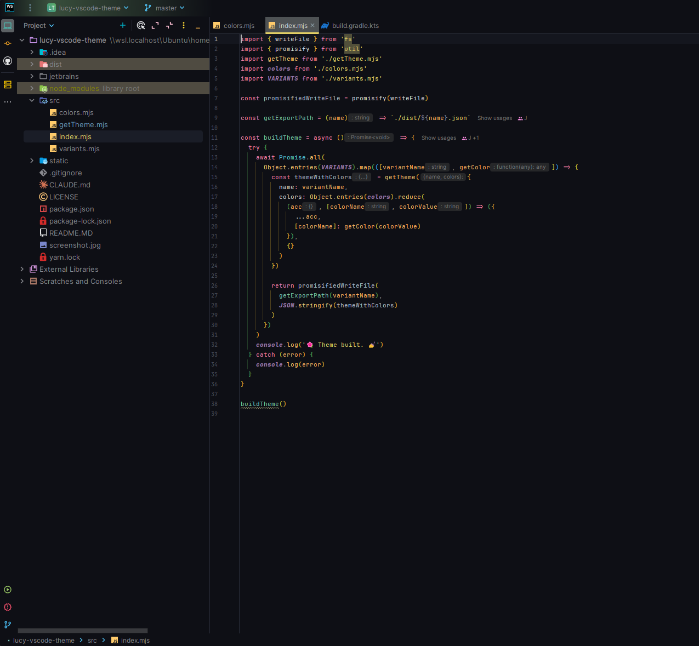

# Lucy Theme

> Soft but clear syntax theme for VS Code and JetBrains IDEs.




---

[](https://marketplace.visualstudio.com/items?itemName=juliettepretot.lucy-vscode)
[](package.json)
[](jetbrains/)

Both themes share the exact same palette (`src/colors.mjs`) and offer two variants:

- **`lucy`**: Standard soft dark theme with high clarity.
- **`lucy-evening`**: Warmer tone dark palette preserving luminosity.

Available on [CodeSandbox](https://codesandbox.io)
and [VS Code Marketplace](https://marketplace.visualstudio.com/items?itemName=juliettepretot.lucy-vscode).

---

## 💻 VS Code (v2.8.2)

- **Compatibility**: VS Code `^1.26.0` or newer
- **Theme files**: Generated into `dist/lucy.json` and `dist/lucy-evening.json`

### Customization & Local Install

1. Modify colors in [`src/colors.mjs`](src/colors.mjs).
2. Build the theme:
   ```bash
   npm run build
   ```
3. To test locally, symlink or copy this entire folder to `~/.vscode/extensions/lucy-vscode`.

---

## 🚀 JetBrains IDEs (v2.8.2)

Compatible with **IntelliJ IDEA**, **WebStorm**, **PyCharm**, **GoLand**, **PhpStorm**, **Rider**, **CLion**, and other
IntelliJ Platform IDEs (version **2025.3+**).

### Build & Packaging

1. **Generate theme JSON & XML schemes**:
   ```bash
   npm run build:jetbrains
   ```

2. **Package the plugin `.zip`**:
    - **With Java 17+ installed locally**:
      ```bash
      cd jetbrains && ./gradlew buildPlugin
      ```
    - **Using Docker (no local Java required)**:
      ```bash
      docker run --rm -u $(id -u):$(id -g) -v "$PWD/jetbrains:/home/gradle/project" -w /home/gradle/project gradle:9-jdk17 ./gradlew buildPlugin --no-daemon
      ```
   The packaged plugin will be generated at:
   `jetbrains/build/distributions/lucy-jetbrains-2.8.2.zip`

3. **Install in your IDE**:
    - Go to **Settings/Preferences** (`Ctrl+Alt+S` or `Cmd+,`) ➔ **Plugins**.
    - Click the gear icon ⚙️ ➔ **Install Plugin from Disk...**.
    - Select `jetbrains/build/distributions/lucy-jetbrains-2.8.2.zip`.

4. **Test in sandbox IDE**:
   ```bash
   cd jetbrains && ./gradlew runIde
   ```

5. **Publish to Marketplace**:
   ```bash
   cd jetbrains && ./gradlew publishPlugin
   ```

